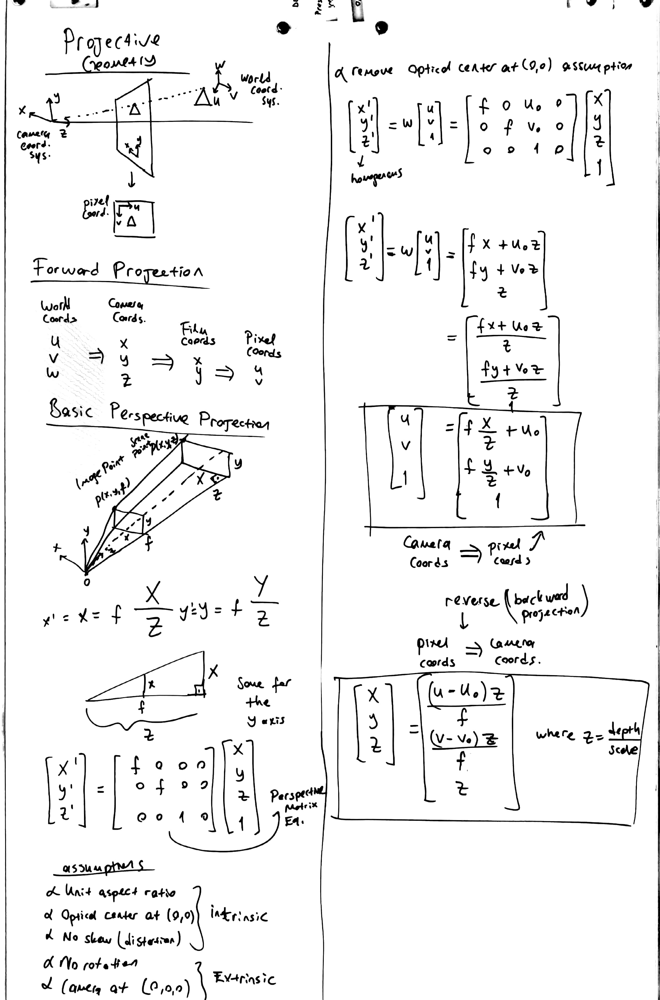
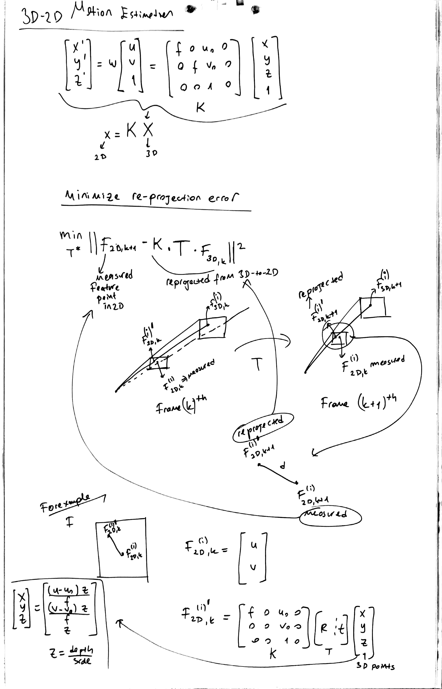
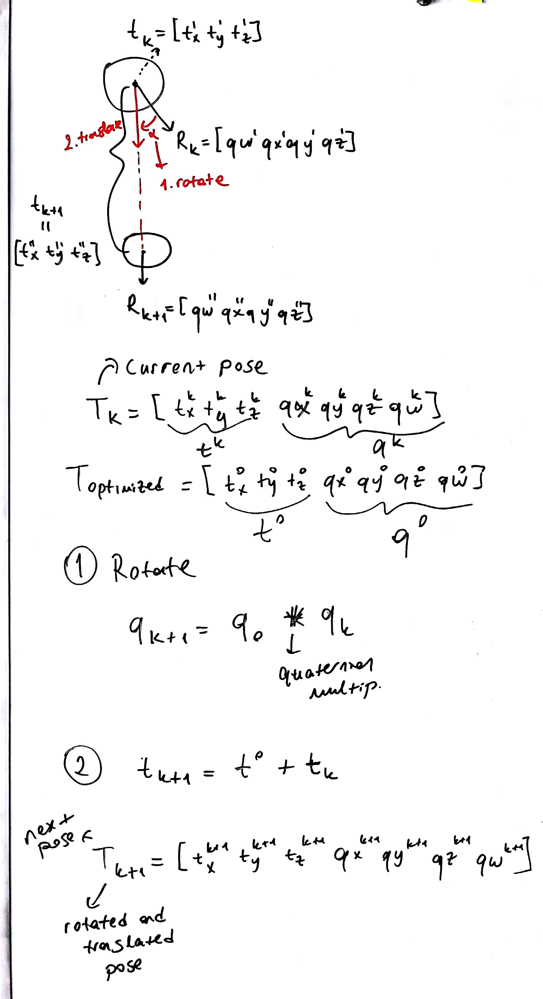
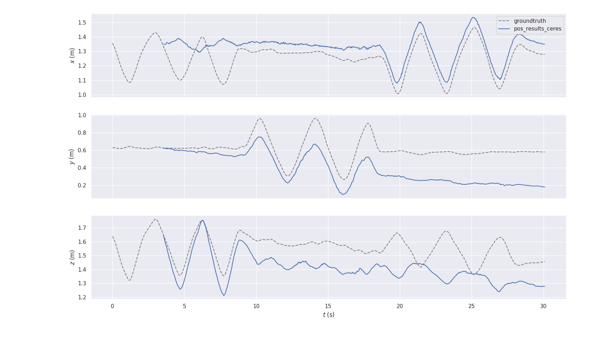
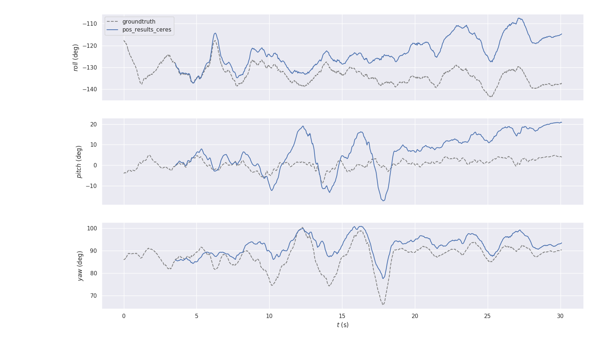

# RGB-D Visual Odometry Using 3d-to-2d Reprojection Error Minimization

# Algorithm

This Visual Odometry (VO) algorithm consists of 4 following components:

## 1. Feature Descriptor

ORB is used to detect key point matches.

https://docs.opencv.org/3.0-beta/doc/py_tutorials/py_feature2d/py_orb/py_orb.html

## 2. RANSAC
To filter out outliers, RANSAC is used. Opencv's RANSAC built-in function accepts a threshold value. Distance of the key point matches tells how far those two feature points are located from each other in consecutive frames. 2*sigma, which represents the pixel uncertainty, is provided as a threshold.

https://docs.opencv.org/3.0-beta/doc/py_tutorials/py_feature2d/py_feature_homography/py_feature_homography.html

## 3. Motion Estimation
3d-to-2d Reprojection error minimization technique is used to calculate rotation and translation for consecutive frames.

### Reprojective Geometry Basics



### 3d-to-2d Motion Estimation (Reprojection Error Minimization)



## 4. Trajectory
Translate and rotate the current pose with optimized transformation result

### Trajectory Building



## Refs:

- Visual Odometry Part I: The First 30 Years and Fundamentals, Davide Scaramuzza, Friedrich Fraundorfer
- Visual Odometry : Part II: Matching, Robustness, Optimization, and Applications, Davide Scaramuzza, Friedrich Fraundorfer
- An Overview to Visual Odometry and Visual SLAM: Applications to Mobile Robotics, Khalid Yousif, Alireza Bab-Hadiashar, Reza Hoseinnezhad

# External Libraries

- OpenCV 3.4 - https://docs.opencv.org/3.4.1/d2/de6/tutorial_py_setup_in_ubuntu.html
- Ceres-Solver - http://ceres-solver.org
- pybind11 - http://pybind11.readthedocs.io
- EVO - https://github.com/MichaelGrupp/evo


# Installation

## Dependencies for OpenCV

```
$ sudo apt-get install build-essential cmake
$ sudo apt-get install python3-dev python3-pip numpy
$ sudo apt-get install libopencv-dev python-opencv
```

## Dependencies for Ceres

Just install dependencies for Ceres but do not build the ceres. 
Since Ceres is already located at $PROJECT_HOME/lib/ceres_reprojection_pybind/lib/external/ceres-solver
and needs to be built along with ceres_reprojection.cpp implementation.

http://ceres-solver.org/installation.html

## Install Virtual Environment for Python

```
$ cd $PROJECT_HOME
$ virtualenv -p python3 venv
$ source venv/bin/activate
```

Install python required packages
```
$ pip install -r requirements.txt
```

## Compile Ceres Optimizer
If Ceres dependencies are installed, the Ceres python binding can be built by following these instructions

```
$ cd $PROJECT_HOME/lib/ceres_reprojection_pybind/
$ mkdir build
$ cd build
$ cmake ..
$ make -j8
```

Then, link ceres library to python virtual env

```
$ ln -s $PROJECT_HOME/lib/ceres_reprojection_pybind/build/ceres_reprojection.cpython-35m-x86_64-linux-gnu.so $PROJECT_HOME/venv/lib/python3.5/site-packages/ceres_reprojection.so
```

Now, you are good to go!

## Where to Locate TUM RGB-D dataset

Download the dataset:

https://vision.in.tum.de/data/datasets/rgbd-dataset

Then, place it '../$PROJECT_HOME'.

# Results

## Translation Results



## Rotation Results




